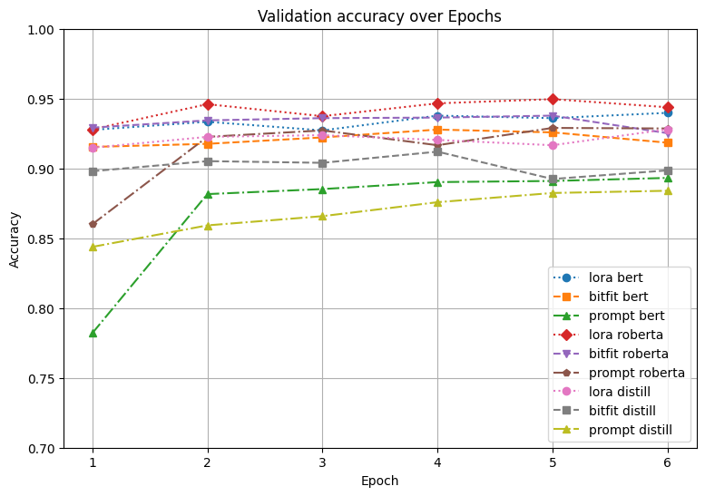
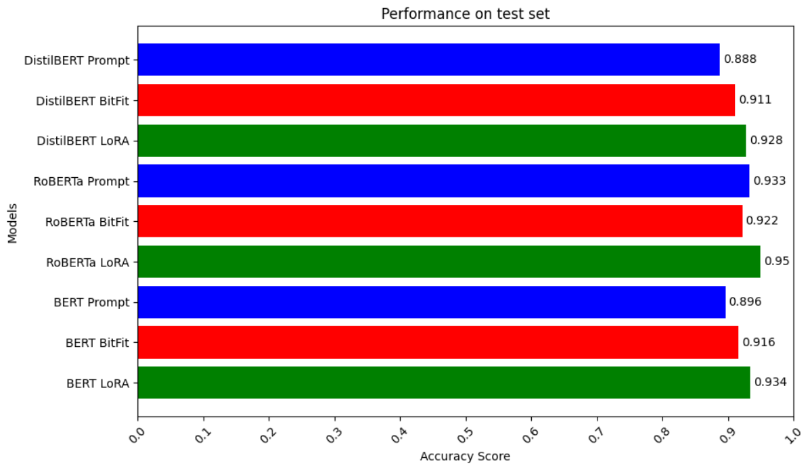
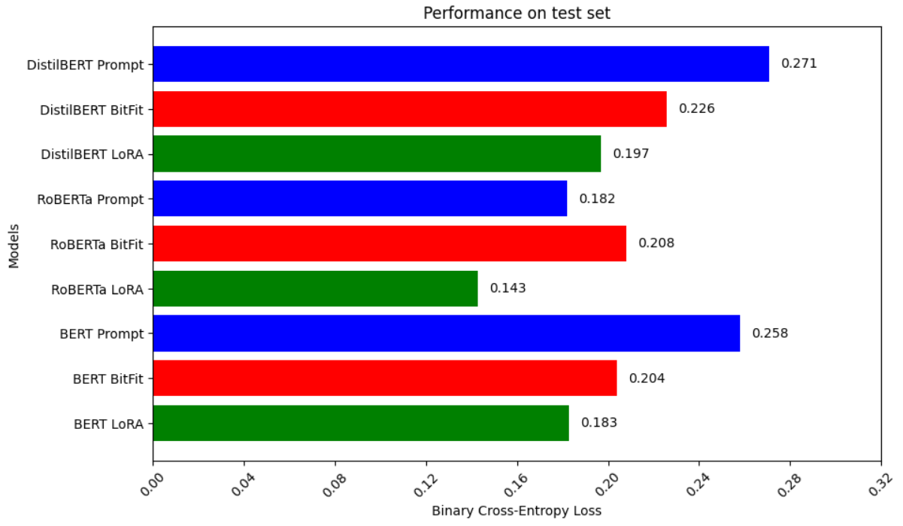
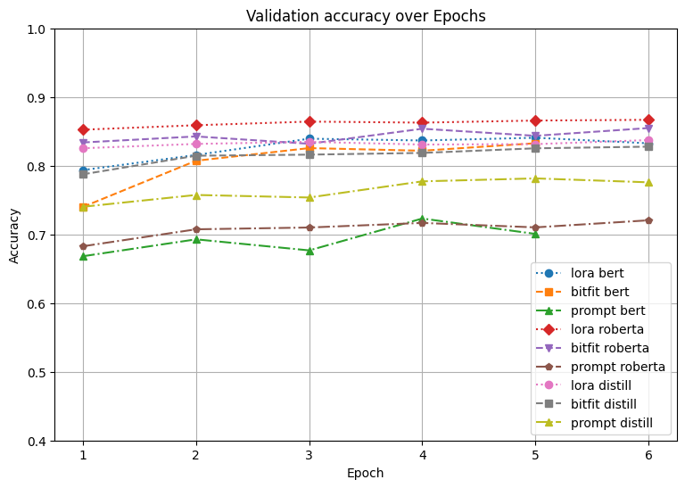
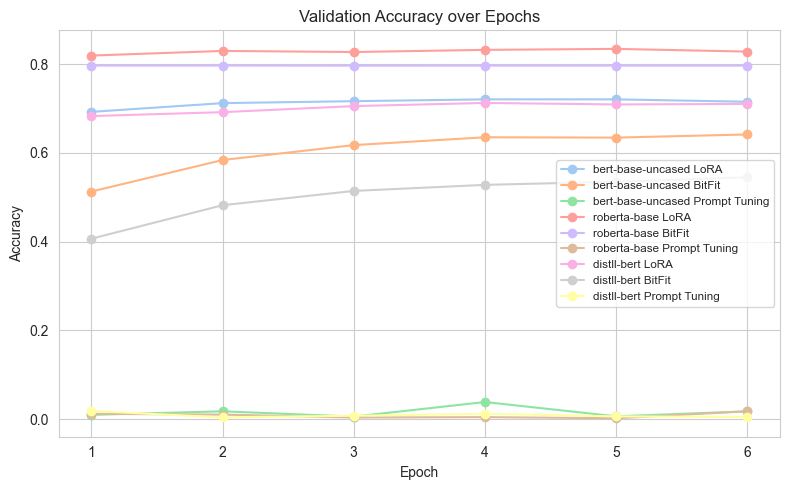

  <h2>VIETNAM NATIONAL UNIVERSITY, HO CHI MINH CITY</h2>
  <h3>UNIVERSITY OF TECHNOLOGY</h3>
  <h3>FACULTY OF COMPUTER SCIENCE AND ENGINEERING</h3>
  
   
  
  
  
   
   

<h2 align="center"> Natural Language Processing (CO3086) </h2>
<h3 align="center"> Class: CC01 - Group 1 </h3>

---

# NLP 242: Assignment Report — Fine-Tuning Techniques Comparison on Transformers
---
## Table of Contents
- [Fine-Tuning Techniques](#fine-tuning-techniques)
- [Models Used](#models-used)
- [Tasks and Results](#tasks-and-results)
  - [Task 1: Question Answering](#task-1-question-answering)
  - [Task 2: Text Classification](#task-2-text-classification)
  - [Task 3: Span Validation or Additional Task](#task-3-span-validation-or-additional-task)
- [Best Results Table](#best-results-table)
- [Notes](#notes)

---
##  Fine-Tuning Techniques

- **LoRA (Low-Rank Adaptation)**: Injects trainable low-rank matrices into attention layers.
- **BitFit**: Only trains the bias terms in transformer layers.
- **Prompt Tuning**: Uses virtual token embeddings prepended to input sequences.

---

##  Models Used

- `bert-base-uncased`
- `roberta-base`
- `distilbert-base-uncased`

---

##  Tasks and Results

### Task 1: Question Answering
 For Task 1, we measure accuracy per epoch, final test accuracy, and final test loss (Binary Cross-Entropy).

#### Accuracy per Epoch

#### Final Test Accuracy

#### Final Test Loss (Binary Cross-Entropy)

---

### Task 2: Text Classification
For Task 2, we measure validation accuracy over epochs and compare our results with existing models.

#### Validation Accuracy Over Epochs

#### Comparison with existing models

| Model Variant         | Sharma et al. (2019) | Ours |
|-----------------------|----------------------|------|
| LR with Trigrams      | 80.8                 | —    |
| SVM with Trigrams     | 80.9                 | —    |
| Random Forest         | 75.7                 | —    |
| Gradient Boosting     | 75.0                 | —    |
| CBOW                  | 83.4                 | —    |
| LSTM + Attention      | 81.8                 | —    |
| BiLSTM + Attention    | 82.3                 | —    |
| BERT + LoRA           | —                    | 84.52|
| BERT + BitFit         | —                    | 83.63|
| BERT + Prompt         | —                    | 72.68|
| RoBERTa + LoRA        | —                    | 86.80|
| RoBERTa + BitFit      | —                    | 85.40|
| RoBERTa + Prompt      | —                    | 72.26|
| DistilBERT + LoRA     | —                    | 84.14|
| DistilBERT + BitFit   | —                    | 82.90|
| DistilBERT + Prompt   | —                    | 77.89|

---

### Task 3: Span Validation or Additional Task
For Task 3, we only report F1 scores on the validation set, to illustrates how well the model perform on predicting the answer span.

#### F1 scores on validation set

#### Best Results Table

| Model         | Fine-Tuning   | Best Result (F1-score) |
|---------------|---------------|---------------------------|
| BERT          | LoRA          | 0.7209                    |
|               | BitFit        | 0.6417                    |
|               | Prompt Tuning | 0.0388                    |
| RoBERTa       | LoRA          | 0.8346                    |
|               | BitFit        | 0.7970                    |
|               | Prompt Tuning | 0.0180                    |
| DistilBERT    | LoRA          | 0.7128                    |
|               | BitFit        | 0.5452                    |
|               | Prompt Tuning | 0.0186                    |

---

##  Notes
- Datasets used:
  - [SQuAD v1.1](https://huggingface.co/datasets/rajpurkar/squad/viewer/plain_text/train?row=12&views%5B%5D=train)
  - [Quora Question Pairs](https://www.kaggle.com/competitions/quora-question-pairs)
  - [IMDb Movie Reviews](https://www.kaggle.com/datasets/lakshmi25npathi/imdb-dataset-of-50k-movie-reviews)
- Experiments were conducted on Kaggle. If you want to test our notebooks please import them on Kaggle.

